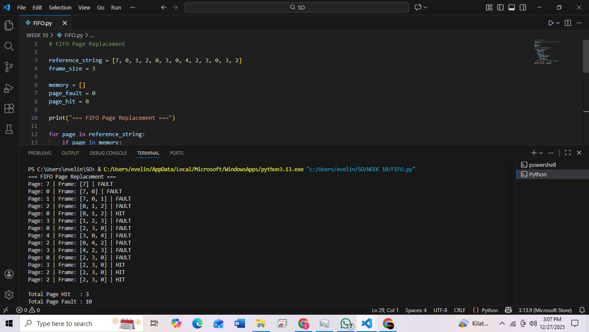
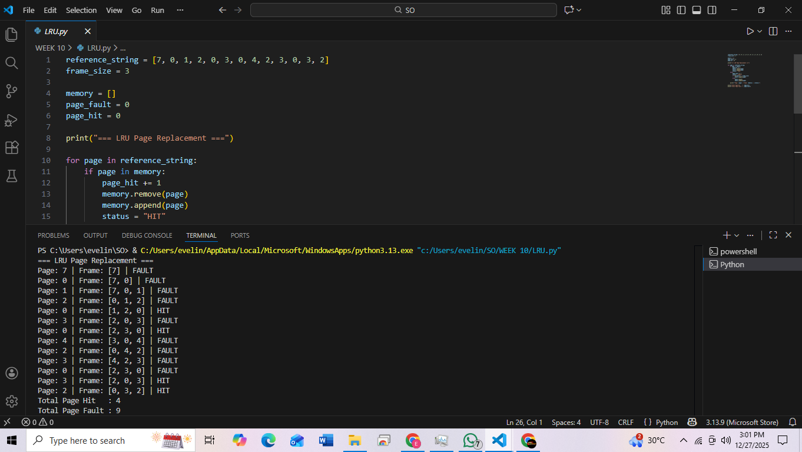

# Laporan Praktikum Minggu X
Topik: Manajemen Memori – Page Replacement (FIFO & LRU)
---

## Identitas
- **Nama**  : Evelin Natalie
- **NIM**   : 250202916  
- **Kelas** : 1IKRA

---

## Tujuan
Setelah menyelesaikan tugas ini, mahasiswa mampu:
1. Mengimplementasikan algoritma page replacement FIFO dalam program.
2. Mengimplementasikan algoritma page replacement LRU dalam program.
3. Menjalankan simulasi page replacement dengan dataset tertentu.
4. Membandingkan performa FIFO dan LRU berdasarkan jumlah *page fault*.
5. Menyajikan hasil simulasi dalam laporan yang sistematis.


---

## Dasar Teori
Manajemen Memori dan Virtual Memory
Manajemen memori adalah bagian dari sistem operasi yang bertugas mengatur penggunaan memori utama (RAM). Dalam konsep virtual memory, program dapat dijalankan meskipun ukuran program lebih besar dari kapasitas RAM dengan memanfaatkan media penyimpanan sekunder. Data dibagi menjadi unit kecil yang disebut page, dan hanya page yang dibutuhkan saja yang dimuat ke memori.

Page Fault dan Page Replacement
Page fault terjadi ketika page yang dibutuhkan proses tidak berada di memori utama. Jika memori penuh, sistem operasi harus mengganti salah satu page yang ada dengan page baru. Proses pemilihan page yang akan dikeluarkan disebut page replacement, dan tujuannya adalah meminimalkan jumlah page fault agar kinerja sistem tetap optimal.

Algoritma FIFO (First In First Out)
FIFO mengganti page yang pertama kali masuk ke memori tanpa memperhatikan apakah page tersebut masih sering digunakan atau tidak. Algoritma ini sederhana dan mudah diimplementasikan, namun kelemahannya adalah dapat menghapus page yang masih dibutuhkan sehingga berpotensi meningkatkan jumlah page fault.

Algoritma LRU (Least Recently Used)
LRU mengganti page yang paling lama tidak digunakan dengan asumsi bahwa page yang jarang digunakan di masa lalu kecil kemungkinan akan digunakan kembali dalam waktu dekat. Algoritma ini umumnya menghasilkan performa lebih baik dibanding FIFO, tetapi membutuhkan mekanisme tambahan untuk mencatat riwayat penggunaan page.

Perbandingan FIFO dan LRU
FIFO lebih sederhana namun kurang efisien, sedangkan LRU lebih kompleks tetapi mampu mengurangi jumlah page fault. Pemilihan algoritma page replacement harus mempertimbangkan keseimbangan antara kompleksitas implementasi dan kinerja sistem secara keseluruhan.

---

## Langkah Praktikum
1. Langkah-langkah yang dilakukan.  
2. Perintah yang dijalankan.  
3. File dan kode yang dibuat.  
4. Commit message yang digunakan.

---

## Kode / Perintah
## D. Langkah Pengerjaan
1. **Menyiapkan Dataset**

   Gunakan *reference string* berikut sebagai contoh:
   ```
   7, 0, 1, 2, 0, 3, 0, 4, 2, 3, 0, 3, 2
   ```
   Jumlah frame memori: **3 frame**.

2. **Implementasi FIFO**

   - Simulasikan penggantian halaman menggunakan algoritma FIFO.
   - Catat setiap *page hit* dan *page fault*.
   - Hitung total *page fault*.

3. **Implementasi LRU**

   - Simulasikan penggantian halaman menggunakan algoritma LRU.
   - Catat setiap *page hit* dan *page fault*.
   - Hitung total *page fault*.

    4. **Eksekusi & Validasi**

   - Jalankan program untuk FIFO dan LRU.
   - Pastikan hasil simulasi logis dan konsisten.
   - Simpan screenshot hasil eksekusi.

5. **Analisis Perbandingan**

   Buat tabel perbandingan seperti berikut:

| Algoritma | Jumlah Page Fault | Keterangan |
| :-------- | :---------------: | :---------- |
| FIFO | 10 | Implementasi sederhana, tetapi kurang efisien karena tidak memperhatikan pola penggunaan halaman |
| LRU       |         9         | Lebih efisien karena mempertahankan halaman yang sering digunakan                                |


   - Jelaskan mengapa jumlah *page fault* bisa berbeda.
   - Analisis algoritma mana yang lebih efisien dan alasannya.

6. **Commit & Push**

   ```bash
   git add .
   git commit -m "Minggu 10 - Page Replacement FIFO & LRU"
   git push origin main
   ```

---

## Hasil Eksekusi
FIFO


LRU


---

## Analisis
   Buat tabel perbandingan seperti berikut:

| Algoritma | Jumlah Page Fault | Keterangan      |
| :-------- | :---------------: | :----------------------------------------------------------------------------------------------- |
| FIFO      |         10        | Implementasi sederhana, tetapi kurang efisien karena tidak memperhatikan pola penggunaan halaman |
| LRU       |         9         | Lebih efisien karena mempertahankan halaman yang sering digunakan                                |
   - Jelaskan mengapa jumlah *page fault* bisa berbeda.

Perbedaan jumlah page fault terjadi karena kebijakan penggantian halaman yang digunakan oleh masing-masing algoritma berbeda:

1. FIFO (First In First Out)
FIFO mengganti halaman yang paling awal masuk ke frame, tanpa memperhatikan apakah halaman tersebut masih sering digunakan atau tidak. Akibatnya, halaman yang sebenarnya masih dibutuhkan dapat terhapus lebih awal. Hal ini menyebabkan terjadinya page fault tambahan ketika halaman tersebut diakses kembali.

2. LRU (Least Recently Used)
LRU mengganti halaman yang paling lama tidak digunakan, dengan asumsi bahwa halaman yang baru saja digunakan kemungkinan besar akan digunakan kembali dalam waktu dekat (temporal locality). Pendekatan ini membuat LRU lebih mampu mempertahankan halaman yang relevan di dalam memori, sehingga dapat mengurangi jumlah page fault.

   - Analisis algoritma mana yang lebih efisien dan alasannya.

Berdasarkan hasil simulasi:

| Algoritma	| Page Hit | Page Fault |
| --------- | -------- | ---------- |
| FIFO |	3 | 10 |
| LRU	| 4 |	9 |

LRU lebih efisien dibandingkan FIFO pada kasus ini, dengan alasan:

Jumlah page fault lebih sedikit
LRU menghasilkan 9 page fault, sedangkan FIFO menghasilkan 10. Semakin sedikit page fault, semakin kecil overhead akses ke memori sekunder.

Memanfaatkan pola akses program
LRU memanfaatkan prinsip locality of reference, sehingga halaman yang sering atau baru digunakan tetap berada di memori lebih lama.

Kinerja sistem lebih baik
Lebih sedikit page fault berarti lebih sedikit operasi I/O disk, yang secara langsung meningkatkan performa sistem.

---

## Kesimpulan
Algoritma page replacement FIFO dan LRU dapat diimplementasikan untuk mensimulasikan mekanisme penggantian halaman pada sistem operasi, dengan tujuan mengelola memori secara efektif dan meminimalkan terjadinya page fault.

Berdasarkan hasil simulasi, algoritma LRU menghasilkan jumlah page fault yang lebih sedikit dibandingkan FIFO, karena LRU mempertimbangkan riwayat penggunaan halaman sehingga lebih sesuai dengan pola akses memori program.

Algoritma FIFO memiliki implementasi yang lebih sederhana, namun kurang efisien dibandingkan LRU karena tidak memperhatikan frekuensi dan waktu penggunaan halaman, sehingga dapat menurunkan performa sistem secara keseluruhan.

---

## E. Tugas & Quiz
### Tugas
1. Buat program simulasi page replacement FIFO dan LRU.
2. Jalankan simulasi dengan dataset uji.
3. Sajikan hasil simulasi dalam tabel atau grafik.
4. Tulis laporan praktikum pada `laporan.md`.

### Quiz
Jawab pada bagian **Quiz** di laporan:
1. Apa perbedaan utama FIFO dan LRU?

terletak pada cara pemilihan halaman yang akan diganti. FIFO mengganti halaman yang pertama kali masuk ke memori tanpa mempertimbangkan apakah halaman tersebut masih sering digunakan atau tidak. Sebaliknya, LRU mengganti halaman yang paling lama tidak digunakan dengan mempertimbangkan riwayat akses halaman, sehingga lebih mencerminkan pola penggunaan memori oleh program.

2. Mengapa FIFO dapat menghasilkan *Belady’s Anomaly*?

FIFO dapat menghasilkan Belady’s Anomaly karena algoritma ini tidak memperhatikan pola akses halaman. Halaman yang sering digunakan bisa saja diganti hanya karena halaman tersebut masuk lebih awal ke dalam memori. Ketika jumlah frame ditambah, urutan halaman yang dikeluarkan dapat berubah sehingga justru meningkatkan jumlah page fault, meskipun kapasitas memori lebih besar.

3. Mengapa LRU umumnya menghasilkan performa lebih baik dibanding FIFO?

LRU umumnya menghasilkan performa yang lebih baik dibanding FIFO karena mengikuti prinsip locality of reference, yaitu halaman yang baru saja diakses memiliki kemungkinan besar untuk diakses kembali. Dengan mengganti halaman yang paling lama tidak digunakan, LRU lebih tepat dalam memilih halaman yang dikeluarkan dari memori dan tidak mengalami Belady’s Anomaly, sehingga jumlah page fault cenderung lebih sedikit.

---

## Refleksi Diri
Tuliskan secara singkat:
- Apa bagian yang paling menantang minggu ini?  
- Bagaimana cara Anda mengatasinya?  

---

**Credit:**  
_Template laporan praktikum Sistem Operasi (SO-202501) – Universitas Putra Bangsa_
