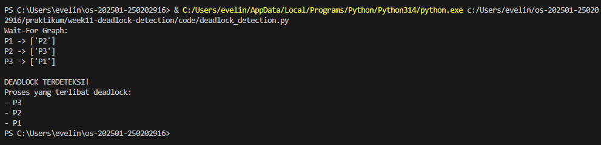

# Laporan Praktikum Minggu [XI]
Topik: Deadlock-Detection

---

## Identitas
- **Nama**  : Evelin Natalie  
- **NIM**   : 250202916 
- **Kelas** : 1IKRA

---

## Tujuan
1. Membuat program sederhana untuk mendeteksi deadlock.  
2. Menjalankan simulasi deteksi deadlock dengan dataset uji.  
3. Menyajikan hasil analisis deadlock dalam bentuk tabel.  
4. Memberikan interpretasi hasil uji secara logis dan sistematis.  
5. Menyusun laporan praktikum sesuai format yang ditentukan.

---

## Dasar Teori

1. Deadlock terjadi ketika sekumpulan proses saling menunggu resource yang sedang dipegang proses lain sehingga tidak ada satu pun proses yang dapat melanjutkan eksekusi.

2. Deadlock detection membiarkan sistem masuk ke kondisi deadlock, kemudian sistem operasi melakukan pemeriksaan untuk mengidentifikasi keberadaan deadlock tersebut.

3. Deteksi deadlock dilakukan dengan menganalisis hubungan alokasi resource, umumnya menggunakan *Resource Allocation Graph* atau algoritma pendeteksian berbasis matriks.

4. Deadlock terdeteksi jika terdapat siklus (cycle) dalam grafik alokasi resource atau jika proses tidak dapat menyelesaikan eksekusi meskipun semua resource tersedia.

5. Setelah deadlock terdeteksi, sistem melakukan pemulihan, seperti menghentikan proses tertentu atau melakukan *rollback* untuk membebaskan resource.


---

## Langkah Praktikum
1. **Menyiapkan Dataset**

   Gunakan dataset sederhana yang berisi:
   - Daftar proses  
   - Resource Allocation  
   - Resource Request / Need

   Contoh tabel:

   | Proses | Allocation | Request |
   |:--:|:--:|:--:|
   | P1 | R1 | R2 |
   | P2 | R2 | R3 |
   | P3 | R3 | R1 |

2. **Implementasi Algoritma Deteksi Deadlock**

   Program minimal harus:
   - Membaca data proses dan resource.  
   - Menentukan apakah sistem berada dalam kondisi deadlock.  
   - Menampilkan proses mana saja yang terlibat deadlock.

3. **Eksekusi & Validasi**

   - Jalankan program dengan dataset uji.  
   - Validasi hasil deteksi dengan analisis manual/logis.  
   - Simpan hasil eksekusi dalam bentuk screenshot.

4. **Analisis Hasil**

   - Sajikan hasil deteksi dalam tabel (proses deadlock / tidak).  
   - Jelaskan mengapa deadlock terjadi atau tidak terjadi.  
   - Kaitkan hasil dengan teori deadlock (empat kondisi).

5. **Commit & Push**

   ```bash
   git add .
   git commit -m "Minggu 11 - Deadlock Detection"
   git push origin main
   ```

---

## Kode / Perintah
```import csv
import os

def read_dataset(filename):
    processes = []
    allocation = {}
    request = {}

    with open(filename, mode='r') as file:
        reader = csv.DictReader(file)
        for row in reader:
            p = row['Process']
            processes.append(p)
            allocation[p] = row['Allocation']
            request[p] = row['Request']

    return processes, allocation, request


def build_wait_for_graph(processes, allocation, request):
    graph = {p: [] for p in processes}

    for p1 in processes:
        for p2 in processes:
            if p1 != p2:
                if request[p1] == allocation[p2]:
                    graph[p1].append(p2)
    return graph


def detect_cycle(graph):
    visited = set()
    stack = set()

    def dfs(node):
        if node in stack:
            return True
        if node in visited:
            return False

        visited.add(node)
        stack.add(node)

        for neighbor in graph[node]:
            if dfs(neighbor):
                return True

        stack.remove(node)
        return False

    for node in graph:
        if dfs(node):
            return True
    return False


def deadlock_processes(graph):
    deadlocked = set()
    for p in graph:
        if graph[p]:
            deadlocked.add(p)
    return deadlocked
```

---

## Hasil Eksekusi


---

## Analisis
 Berdasarkan hasil eksekusi program deteksi deadlock menggunakan dataset uji, diperoleh hasil bahwa sistem berada dalam kondisi deadlock. Hal ini dapat dilihat dari terbentuknya siklus pada wait-for graph yang dibangun dari hubungan allocation dan request antar proses.

Pada dataset uji, setiap proses memegang satu resource dan secara bersamaan meminta resource lain yang sedang dipegang oleh proses berbeda. Kondisi ini menyebabkan proses saling menunggu tanpa adanya proses yang dapat melanjutkan eksekusi. Secara spesifik:

Proses P1 menunggu resource yang dialokasikan ke P2.

Proses P2 menunggu resource yang dialokasikan ke P3.

Proses P3 menunggu resource yang dialokasikan ke P1.

Keadaan tersebut membentuk siklus tertutup, sehingga memenuhi indikator utama terjadinya deadlock. Program berhasil mendeteksi siklus ini melalui algoritma pencarian cycle pada wait-for graph, sehingga proses-proses yang terlibat diklasifikasikan sebagai proses deadlock.

Jika dikaitkan dengan empat kondisi deadlock, hasil praktikum ini memenuhi seluruh kondisi berikut:

- Mutual exclusion: resource hanya dapat digunakan oleh satu proses pada satu waktu.
- Hold and wait: setiap proses menahan resource sambil menunggu resource lain.
- No preemption: resource tidak dapat diambil paksa dari proses lain.
- Circular wait: terdapat siklus menunggu antar proses.

---

## Kesimpulan
1. Program simulasi yang dibuat berhasil mendeteksi deadlock dengan menganalisis hubungan allocation dan request antar proses.

2. Deadlock teridentifikasi ketika terbentuk siklus pada wait-for graph, yang menunjukkan adanya proses saling menunggu resource.

3. Dataset uji yang digunakan memenuhi keempat kondisi deadlock sehingga sistem berada dalam kondisi deadlock.

4. Pendekatan deadlock detection memungkinkan pemanfaatan resource yang lebih optimal, namun deadlock baru ditangani setelah terjadi.

5. Praktikum ini membantu memahami konsep deadlock detection secara teoritis dan praktis melalui simulasi sederhana.

---

 ### Tugas
1. Buat program simulasi deteksi deadlock.  
2. Jalankan program dengan dataset uji.  
3. Sajikan hasil analisis dalam tabel dan narasi.  
4. Tulis laporan praktikum pada `laporan.md`.

### Quiz
Jawab pada bagian **Quiz** di laporan:
1. Perbedaan *Deadlock Prevention*, *Avoidance*, dan *Detection*

a.Deadlock Prevention

Pendekatan ini mencegah deadlock sejak awal** dengan cara menghilangkan minimal satu dari empat kondisi deadlock:

1. Mutual exclusion
2. Hold and wait
3. No preemption
4. Circular wait

Contoh:

- Proses harus meminta semua resource sekaligus (mencegah *hold and wait*).
- Resource dapat di-preempt (diambil paksa).

Deadlock tidak mungkin terjadi, tetapi fleksibilitas sistem berkurang.


b. Deadlock Avoidance

Pendekatan ini menghindari kondisi deadlock dengan mengatur alokasi resource secara dinamis agar sistem selalu berada dalam *safe state*.

Contoh: Banker’s Algorithm
Deadlock dihindari, tetapi sistem harus mengetahui kebutuhan maksimum resource tiap proses.


c. Deadlock Detection

Pendekatan ini membiarkan deadlock terjadi, lalu sistem mendeteksinya dan melakukan pemulihan.

Contoh:

- Membangun *resource allocation graph* dan mencari siklus.

Deadlock boleh terjadi, tetapi akan ditangani setelah terdeteksi.

2. Mengapa Deteksi Deadlock Tetap Diperlukan?

Deteksi deadlock diperlukan karena:

1. Tidak semua sistem bisa menerapkan prevention atau avoidance

   - Terlalu membatasi
   - Sulit mengetahui kebutuhan maksimum resource

2. Lebih fleksibel untuk sistem kompleks

   - Sistem database
   - Sistem operasi besar dengan banyak proses

3. Efisiensi resource lebih baik

   - Resource dimanfaatkan secara maksimal
   - Tidak terlalu konservatif seperti avoidance

4. Deadlock jarang terjadi

   - Lebih efisien mendeteksi sesekali daripada mencegah terus-menerus


3. Kelebihan dan Kekurangan Pendekatan Deteksi Deadlock

Kelebihan

- Pemanfaatan resource lebih optimal
- Sistem lebih fleksibel
- Implementasi relatif sederhana
- Cocok untuk sistem dengan beban dinamis

Kekurangan

- Deadlock sudah terjadi → proses terhenti sementara
- Overhead deteksi (pemeriksaan siklus)
- Pemulihan bisa kompleks:

  - Terminate proses
  - Rollback
- Bisa menyebabkan *starvation* pada proses tertentu


---

## Refleksi Diri
Tuliskan secara singkat:
- Apa bagian yang paling menantang minggu ini?  
- Bagaimana cara Anda mengatasinya?  

---

**Credit:**  
_Template laporan praktikum Sistem Operasi (SO-202501) – Universitas Putra Bangsa_
