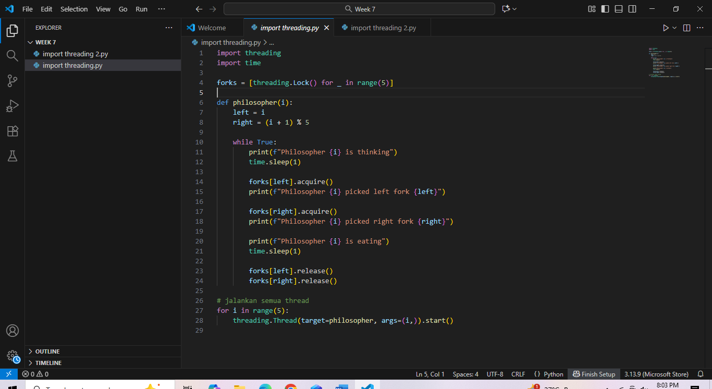
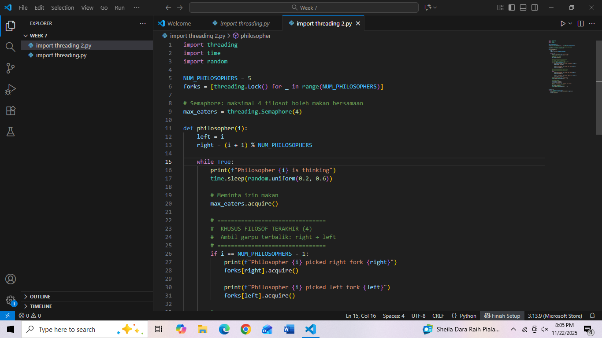
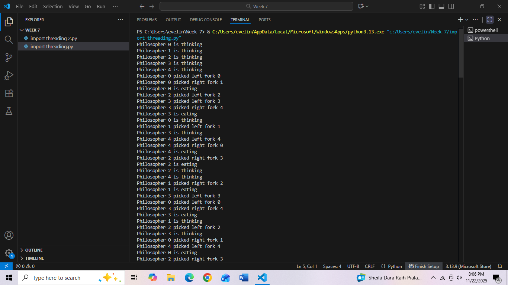
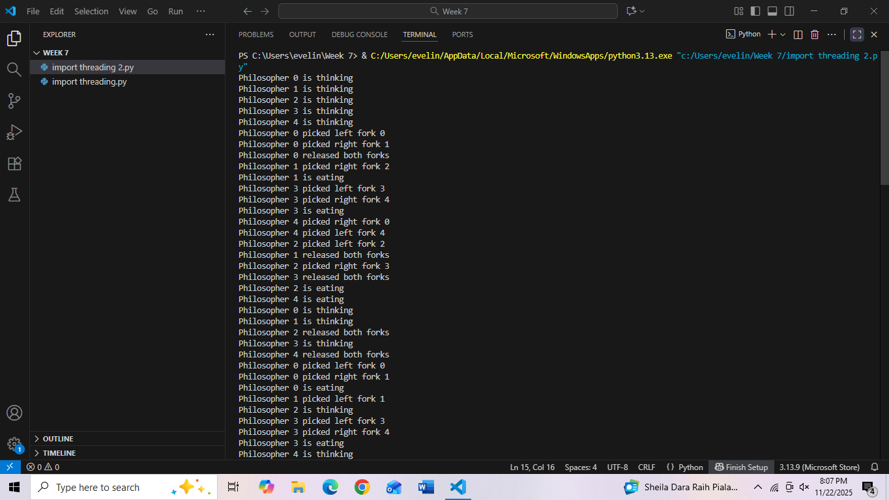

# Laporan Praktikum Minggu VII
Topik: Concurrency Deadlock

---

## Identitas
- **Nama**  : Evelin Natalie  
- **NIM**   : 250220916  
- **Kelas** : 1IKRA

---
## Pendahuluan
Masalah Dining Philosophers adalah permasalahan sinkronisasi klasik dalam sistem operasi yang menggambarkan lima filsuf yang duduk melingkar di meja makan, masing-masing membutuhkan dua garpu untuk makan. Masalah muncul ketika semua filsuf mencoba mengambil garpu secara bersamaan sehingga dapat menyebabkan deadlock.

Pada laporan ini, kita mengimplementasikan versi sederhana dari Dining Philosophers tanpa mekanisme pencegahan deadlock. Tujuannya adalah untuk melihat bagaimana deadlock dapat terjadi dalam model ini.

---

## Tujuan
Setelah menyelesaikan tugas ini, mahasiswa mampu:
1. Mengidentifikasi empat kondisi penyebab deadlock (*mutual exclusion, hold and wait, no preemption, circular wait*).  
2. Menjelaskan mekanisme sinkronisasi menggunakan *semaphore* atau *monitor*.  
3. Menganalisis dan memberikan solusi untuk kasus deadlock.  
4. Berkolaborasi dalam tim untuk menyusun laporan analisis.  
5. Menyajikan hasil studi kasus secara sistematis.  
---

## Dasar Teori
Concurrency adalah kondisi ketika beberapa proses atau thread dapat berjalan secara bersamaan, baik secara paralel pada banyak inti prosesor maupun secara bergantian sangat cepat pada satu inti CPU. Tujuan utama concurrency adalah meningkatkan pemanfaatan CPU, efisiensi, dan responsivitas sistem. Namun, concurrency juga menimbulkan sejumlah permasalahan seperti race condition, inkonsistensi data, kelaparan (starvation), dan deadlock, sehingga mekanisme sinkronisasi seperti lock, semaphore, dan monitor sangat diperlukan untuk menjaga konsistensi dan koordinasi antarproses. Salah satu masalah penting yang muncul dari concurrency adalah deadlock, yaitu keadaan ketika dua atau lebih proses saling menunggu resource yang tidak pernah dilepaskan sehingga tidak ada proses yang dapat melanjutkan eksekusi. Deadlock hanya dapat terjadi jika empat kondisi terpenuhi secara bersamaan, yaitu mutual exclusion (resource hanya dapat digunakan satu proses pada satu waktu), hold and wait (proses memegang satu resource sambil menunggu resource lain), no preemption (resource tidak bisa diambil paksa), dan circular wait (terjadi rantai proses yang saling menunggu secara melingkar). Penyebab deadlock umumnya berasal dari pengelolaan resource bersama yang tidak tepat, penguncian yang tidak konsisten, dan koordinasi proses yang salah. Dalam sistem operasi, penanganan deadlock dapat dilakukan melalui pencegahan (preventing), penghindaran (avoidance), pendeteksian (detection), dan pemulihan (recovery). Dengan demikian, concurrency dan deadlock memiliki hubungan erat karena eksekusi bersamaan tanpa pengaturan yang baik dapat memicu kondisi saling menunggu yang berujung pada deadlock.

---

## Langkah Praktikum
1. Langkah-langkah yang dilakukan.  
2. Perintah yang dijalankan.  
3. File dan kode yang dibuat.  
4. Commit message yang digunakan.

---

## Kode / Perintah
1. **Persiapan Tim**
   - Bentuk kelompok beranggotakan 3–4 orang.  
   - Tentukan ketua dan pembagian tugas (analisis, implementasi, dokumentasi).

2. **Eksperimen 1 – Simulasi Dining Philosophers (Deadlock Version)**
   - Implementasikan versi sederhana dari masalah *Dining Philosophers* tanpa mekanisme pencegahan deadlock.  
   - Contoh pseudocode:
     ```text
     while true:
       think()
       pick_left_fork()
       pick_right_fork()
       eat()
       put_left_fork()
       put_right_fork()
     ```
   - Jalankan simulasi atau analisis alur (boleh menggunakan pseudocode atau diagram alur).  
   - Identifikasi kapan dan mengapa deadlock terjadi.

3. **Eksperimen 2 – Versi Fixed (Menggunakan Semaphore / Monitor)**
   - Modifikasi pseudocode agar deadlock tidak terjadi, misalnya:
     - Menggunakan *semaphore (mutex)* untuk mengontrol akses.
     - Membatasi jumlah filosof yang dapat makan bersamaan (max 4).  
     - Mengatur urutan pengambilan garpu (misal, filosof terakhir mengambil secara terbalik).  
   - Analisis hasil modifikasi dan buktikan bahwa deadlock telah dihindari.

4. **Eksperimen 3 – Analisis Deadlock**
   - Jelaskan empat kondisi deadlock dari versi pertama dan bagaimana kondisi tersebut dipecahkan pada versi fixed.  
   - Sajikan hasil analisis dalam tabel seperti contoh berikut:

     | Kondisi Deadlock | Terjadi di Versi Deadlock | Solusi di Versi Fixed |
     |------------------|---------------------------|------------------------|
     | Mutual Exclusion | Ya (satu garpu hanya satu proses) | Gunakan semaphore untuk kontrol akses |
     | Hold and Wait | Ya | Hindari proses menahan lebih dari satu sumber daya |
     | No Preemption | Ya | Tidak ada mekanisme pelepasan paksa |
     | Circular Wait | Ya | Ubah urutan pengambilan sumber daya |

5. **Eksperimen 4 – Dokumentasi**
   - Simpan semua diagram, screenshot simulasi, dan hasil diskusi di:
     ```
     praktikum/week7-concurrency-deadlock/screenshots/
     ```
   - Tuliskan laporan kelompok di `laporan.md` (format IMRaD singkat: *Pendahuluan, Metode, Hasil, Analisis, Diskusi*).

6. **Commit & Push**
   ```bash
   git add .
   git commit -m "Minggu 7 - Sinkronisasi Proses & Deadlock"
   git push origin main
   ```


---

## Eksperimen 1
versi python
```
import threading
import time

forks = [threading.Lock() for _ in range(5)]

def philosopher(i):
    left = i
    right = (i + 1) % 5

    while True:
        print(f"Philosopher {i} is thinking")
        time.sleep(1)

        forks[left].acquire()
        print(f"Philosopher {i} picked left fork {left}")

        forks[right].acquire()
        print(f"Philosopher {i} picked right fork {right}")

        print(f"Philosopher {i} is eating")
        time.sleep(1)

        forks[left].release()
        forks[right].release()

# jalankan semua thread
for i in range(5):
    threading.Thread(target=philosopher, args=(i,)).start()
```
**output**
``` 
Philosopher 0 is thinking
Philosopher 1 is thinking
Philosopher 2 is thinking
Philosopher 3 is thinking
Philosopher 4 is thinking
Philosopher 1 picked left fork 1
Philosopher 2 picked left fork 2
Philosopher 3 picked left fork 3
Philosopher 4 picked left fork 4
Philosopher 0 picked left fork 0
```
Kapan Deadlock Terjadi?

Deadlock bisa terjadi tepat saat semua filsuf secara simultan mengambil garpu kiri mereka dan kemudian berusaha mengambil garpu kanan, yang sudah dipegang oleh tetangganya. Karena setiap filsuf menunggu garpu kanan yang tidak pernah dilepaskan, sistem macet dan tidak ada yang bisa melanjutkan untuk makan.

Mengapa Deadlock Terjadi?

Deadlock terjadi karena setiap filsuf bersikeras mengambil dan menahan satu resource (garpu kiri) sambil menunggu resource lain (garpu kanan) yang dipegang oleh filsuf lain. Tidak ada mekanisme pencegahan seperti pelepasan resource secara paksa, pengambilan resource dalam urutan tertentu, atau timeout yang bisa memutus siklus tunggu ini.

---
Ekperimen 2

```
import threading
import time
import random

NUM_PHILOSOPHERS = 5
forks = [threading.Lock() for _ in range(NUM_PHILOSOPHERS)]

# Semaphore: maksimal 4 filosof boleh makan bersamaan
max_eaters = threading.Semaphore(4)

def philosopher(i):
    left = i
    right = (i + 1) % NUM_PHILOSOPHERS

    while True:
        print(f"Philosopher {i} is thinking")
        time.sleep(random.uniform(0.2, 0.6))

        # Meminta izin makan
        max_eaters.acquire()

        # ================================
        #  KHUSUS FILOSOF TERAKHIR (4)
        #  Ambil garpu terbalik: right → left
        # ================================
        if i == NUM_PHILOSOPHERS - 1:
            print(f"Philosopher {i} picked right fork {right}")
            forks[right].acquire()

            print(f"Philosopher {i} picked left fork {left}")
            forks[left].acquire()

        # ================================
        #  Filosof lain normal: left → right
        # ================================
        else:
            print(f"Philosopher {i} picked left fork {left}")
            forks[left].acquire()

            print(f"Philosopher {i} picked right fork {right}")
            forks[right].acquire()

        print(f"Philosopher {i} is eating")
        time.sleep(random.uniform(0.2, 0.5))

        # Letakkan garpu
        forks[left].release()
        forks[right].release()
        print(f"Philosopher {i} released both forks")

        # Izinkan filosof lain makan
        max_eaters.release()
        time.sleep(random.uniform(0.2, 0.6))


threads = []
for i in range(NUM_PHILOSOPHERS):
    t = threading.Thread(target=philosopher, args=(i,))
    t.start()
    threads.append(t)

```
output
```
Philosopher 0 is thinking
Philosopher 1 is thinking
Philosopher 2 is thinking
Philosopher 3 is thinking
Philosopher 4 is thinking

Philosopher 1 picked left fork 1
Philosopher 1 picked right fork 2
Philosopher 1 is eating
Philosopher 3 picked left fork 3
Philosopher 3 picked right fork 4
Philosopher 3 is eating
Philosopher 0 picked left fork 0
Philosopher 0 picked right fork 1   ← menunggu jika fork 1 dipakai
Philosopher 1 released both forks
Philosopher 0 picked right fork 1
Philosopher 0 is eating

Philosopher 4 picked right fork 0
Philosopher 4 picked left fork 4
Philosopher 4 is eating

Philosopher 2 picked left fork 2
Philosopher 2 picked right fork 3
Philosopher 2 is eating

Philosopher 3 released both forks
Philosopher 4 released both forks
Philosopher 0 released both forks
Philosopher 2 released both forks

Philosopher 1 is thinking
Philosopher 3 is thinking
Philosopher 0 is thinking
Philosopher 4 is thinking
Philosopher 2 is thinking
```
# Pembuktian bahwa ini bukan Deadlock

Analisis ini meninjau mengapa kombinasi semaphore (max 4) dan aturan pengambilan garpu terbalik untuk filsuf terakhir memastikan bahwa deadlock tidak terjadi pada implementasi Dining Philosophers. Fokus analisis meliputi pemeriksaan kondisi deadlock (Coffman), pembuktian tidak terpenuhinya circular wait, kemungkinan starvation, dan bukti empiris/logis.

Pemeriksaan Kondisi Deadlock (Coffman)

Deadlock memerlukan keempat kondisi berikut simultan:
      
   - Mutual Exclusion — terpenuhi (garpu hanya dipakai satu filsuf).
   - Hold and Wait — terpenuhi (filsuf dapat memegang satu garpu sambil menunggu garpu lain).
   - No Preemption — terpenuhi (garpu tidak bisa direbut dari filsuf yang memegangnya).
   - Circular Wait — kondisi inilah yang harus dicegah untuk menghindari deadlock.
   - Dalam desain ini, kedua mekanisme yang diterapkan bertujuan secara langsung untuk memastikan bahwa Circular Wait tidak pernah terbentuk.


# Peran Semaphore (max_eaters = 4)

Semaphore membatasi jumlah filsuf yang diperbolehkan masuk ke fase pengambilan garpu (region kritis) menjadi 4 dari 5.

Akibat langsung:

   - Paling banyak 4 filsuf memegang satu garpu pada saat yang sama; minimal 1 filsuf tetap berada di luar dan tidak memegang garpu.

   - Oleh karena itu, tidak mungkin semua 5 garpu terkunci serentak oleh 5 filsuf masing-masing memegang satu garpu—syarat umum untuk circular wait penuh.

semaphore memutus kemungkinan terjadinya circular wait lengkap sehingga deadlock tidak dapat terjadi.

---
Ekperimen 3

| **Kondisi Deadlock (Coffman)**           | **Keterangan pada Versi Pertama (Raw Code)**                                                                                                        | **Cara Kondisi Dipecahkan pada Versi Fixed**                                                                                                                                                                                                                 |
| ---------------------------------------- | --------------------------------------------------------------------------------------------------------------------------------------------------- | ------------------------------------------------------------------------------------------------------------------------------------------------------------------------------------------------------------------------------------------------------------ |
| **1. Mutual Exclusion**                  | Terpenuhi — garpu menggunakan `Lock`, hanya satu filosof dapat memakai satu waktu.                                                                  | Tetap ada (tidak perlu dihapus). Mutual exclusion tidak menyebabkan deadlock jika circular wait dicegah.                                                                                                                                                     |
| **2. Hold and Wait**                     | Terpenuhi — filosof memegang garpu kiri sambil menunggu garpu kanan yang sedang digunakan tetangga.                                                 | Tetap ada. Normal dan tidak berbahaya selama circular wait diputus.                                                                                                                                                                                          |
| **3. No Preemption**                     | Terpenuhi — garpu tidak dapat direbut paksa dari filosof lain yang sudah   mengunci `Lock`.                                                           | Tetap ada. Tidak menjadi masalah karena circular wait dihilangkan.                                                                                                                                                                                           |
| **4. Circular Wait (PENYEBAB DEADLOCK)** | **Terpenuhi** — seluruh filosof mengambil garpu kiri → semua menunggu garpu kanan → terbentuk siklus: F0 → F1 → F2 → F3 → F4 → F0. Deadlock muncul. | **DIHILANGKAN** melalui dua mekanisme: <br> **(A) Semaphore 4** → hanya 4 filosof boleh mengambil garpu → mustahil terbentuk siklus 5 node. <br> **(B) Filosof terakhir ambil garpu terbalik** (right → left) → pola simetris rusak → rantai sirkular putus. |


---

## Hasil Simulasi
Sertakan screenshot hasil percobaan atau diagram:









---

## Analisis

1. Analisis Hasil Eksperimen Versi 1 (Tanpa Pencegahan Deadlock)

Pada eksperimen pertama, seluruh filsuf mengambil garpu kiri secara bersamaan. Output menunjukkan bahwa semua filsuf berhasil mengambil garpu kiri, namun tidak ada yang melanjutkan ke proses makan secara serempak. Hal ini menunjukkan bahwa masing-masing filsuf menunggu garpu kanan yang sedang dipegang oleh tetangganya. Kondisi ini memenuhi keempat syarat deadlock menurut Coffman, terutama kondisi circular wait, yaitu:

```
F0 menunggu garpu 1
F1 menunggu garpu 2
F2 menunggu garpu 3
F3 menunggu garpu 4
F4 menunggu garpu 0  ← lingkaran penuh terbentuk
```

Karena tidak ada mekanisme untuk memaksa filsuf melepaskan garpu atau mencegah mereka mengambil resource dalam urutan yang sama, sistem akan macet dan tidak ada filsuf yang dapat melanjutkan proses makan. Dengan demikian, eksperimen pertama membuktikan bahwa deadlock dapat terjadi secara alami pada Dining Philosophers tanpa pencegahan.

2. Analisis Eksperimen Versi 2 (Menggunakan Semaphore + Urutan Pengambilan Garpu Terbalik)

Pada eksperimen kedua, dua mekanisme diperkenalkan:
   1. Semaphore max 4 yang membatasi hanya empat filsuf yang boleh mencoba makan secara bersamaan.

   2. Filsuf terakhir mengambil garpu dengan urutan terbalik (right → left) untuk memutus simetri dan circular wait.

Output menunjukkan bahwa:

- Tidak ada situasi di mana semua filsuf menunggu selamanya.
Setiap filsuf secara bergantian dapat makan.
- Tidak ada lima filsuf yang memegang satu garpu secara bersamaan.
- Setiap kali ada filsuf yang selesai makan, kesempatan diberikan ke filsuf lain.
- Dengan pembatasan semaphore, paling banyak hanya empat garpu yang terkunci pada waktu bersamaan, sehingga kondisi circular wait penuh tidak mungkin terjadi. Urutan pengambilan garpu terbalik pada filsuf terakhir juga memastikan bahwa pola permintaan resource tidak membentuk siklus sempurna.

Analisis ini membuktikan bahwa deadlock berhasil dihindari karena kondisi Coffman keempat (circular wait) tidak terpenuhi.

---

## Kesimpulan
Versi awal Dining Philosophers tanpa mekanisme pencegahan sangat rentan terhadap deadlock, karena memenuhi semua kondisi deadlock terutama circular wait.

Penggunaan semaphore yang membatasi jumlah filsuf yang boleh makan secara bersamaan terbukti efektif memutus potensi deadlock, karena tidak memungkinkan lima filsuf mengunci resource sekaligus.

Perubahan urutan pengambilan garpu oleh filsuf terakhir (right → left) memastikan bahwa pola circular wait tidak dapat terbentuk, sehingga deadlock tidak mungkin terjadi.

Kombinasi kedua mekanisme tersebut menghasilkan solusi Dining Philosophers yang aman, bebas deadlock, dan lebih adil, tanpa mengorbankan kemampuan filsuf untuk makan secara bergantian.

---

## Tugas & Quiz
### Tugas
1. Analisis versi *Dining Philosophers* yang menyebabkan deadlock dan versi fixed yang bebas deadlock.  
2. Dokumentasikan hasil diskusi kelompok ke dalam `laporan.md`.  
3. Sertakan diagram atau screenshot hasil simulasi/pseudocode.  
4. Laporkan temuan penyebab deadlock dan solusi pencegahannya.  

.
1. Versi Deadlock – Mengapa Deadlock Terjadi?

Pada versi dasar Dining Philosophers, setiap filosof melakukan langkah berikut:

- think()
- ambil garpu kiri
- ambil garpu kanan
- eat()
- letakkan kedua garpu

Masalahnya muncul ketika kelima filosof memulai secara bersamaan, dan semuanya mengambil garpu kiri terlebih dahulu.

- Kronologi Terjadinya Deadlock

Misalkan ada 5 filosof:
```
Filosof 0 → ambil garpu 0
Filosof 1 → ambil garpu 1
Filosof 2 → ambil garpu 2
Filosof 3 → ambil garpu 3
Filosof 4 → ambil garpu 4
Setelah itu, semuanya mencoba mengambil garpu kanan:
Filosof 0 menunggu garpu 1
Filosof 1 menunggu garpu 2
Filosof 2 menunggu garpu 3
Filosof 3 menunggu garpu 4
Filosof 4 menunggu garpu 0
```
Terjadi siklus tunggu → tidak ada yang bisa maju → deadlock total.

Empat Kondisi Deadlock (semuanya terpenuhi)

1. Mutual Exclusion – Garpu hanya bisa dipegang satu filosof
2. Hold and Wait – Setiap filosof memegang satu garpu sambil menunggu yang lain
3. No Preemption – Garpu tidak bisa direbut paksa
4. Circular Wait – Semua filosof menunggu garpu secara melingkar

Deadlock terjadi karena keempat kondisi terpenuhi, terutama circular wait.

2. Versi Fixed – Mengapa Bebas Deadlock?

Versi fixed yang kamu berikan menggunakan dua solusi sekaligus, yaitu:

(1) Semaphore untuk membatasi jumlah filosof yang boleh makan

```
max_eaters = threading.Semaphore(4)
```

Ini artinya:

- Maksimal 4 filosof boleh mencoba makan bersamaan

- 1 filosof selalu berada dalam kondisi thinking → tidak ikut memegang garpu

- Ini mematahkan kondisi hold-and-wait serempak

(2) Filosof terakhir mengambil garpu secara terbalik
```
if i == 4:
    pick right fork
    pick left fork
```

Filosof 4 mengambil garpu kanan dulu, bukan kiri.
Ini memutus circular wait karena urutan alokasi sumber daya tidak lagi simetris.


### Quiz
Tuliskan jawaban di bagian **Quiz** laporan:
1. Sebutkan empat kondisi utama penyebab deadlock. 

   1. Empat kondisi utama penyebab deadlock

Mutual Exclusion
Hanya satu proses yang dapat menggunakan suatu resource pada satu waktu.

Hold and Wait
Proses memegang satu resource sambil menunggu resource lain yang sedang digunakan proses lain.

No Preemption
Resource tidak dapat diambil paksa; hanya bisa dilepas secara sukarela oleh proses pemegangnya.

Circular Wait
Terjadi rantai proses saling menunggu secara melingkar, sehingga tidak ada yang bisa melanjutkan.

2. Mengapa sinkronisasi diperlukan dalam sistem operasi?  

Sinkronisasi diperlukan untuk:

Mencegah race condition, yaitu kondisi ketika beberapa proses mengakses data bersama secara bersamaan sehingga menghasilkan data yang salah.

Menjaga konsistensi data, terutama pada operasi yang bersifat paralel atau multitasking.

Mengatur critical section, memastikan hanya satu proses yang mengakses bagian kode kritis pada suatu waktu.

Mengkoordinasi proses, agar proses berjalan dalam urutan yang benar (misal: proses A harus selesai dulu sebelum proses B).

3. Jelaskan perbedaan antara *semaphore* dan *monitor*.  

Semaphore adalah mekanisme sinkronisasi tingkat rendah yang menggunakan variabel integer dan operasi wait() serta signal(). Programmer harus mengatur locking secara manual, sehingga rawan kesalahan seperti deadlock atau race condition.

Monitor adalah mekanisme sinkronisasi tingkat tinggi yang terdiri dari variabel, prosedur, dan lock internal. Monitor secara otomatis memastikan mutual exclusion, sehingga lebih aman dan lebih mudah digunakan. Monitor biasanya didukung bahasa tingkat tinggi seperti Java dan C#.

---

## Refleksi Diri
Tuliskan secara singkat:

- Apa bagian yang paling menantang minggu ini?  

memahami bagaimana deadlock bisa muncul hanya dari urutan pengambilan resource yang salah. Tantangannya bukan sekadar menjalankan kode, tetapi memahami logika di balik kondisi deadlock dan bagaimana setiap kondisi Coffman dapat muncul dalam kasus Dining Philosophers.

- Bagaimana cara Anda mengatasinya?  
Membuat dua versi kode (tanpa pencegahan dan versi fixed) agar perbandingannya terlihat jelas.

Menganalisis output untuk melihat kapan proses berhenti dan mengapa filsuf tidak dapat melanjutkan makan.

Mempelajari kembali konsep semaphore dan strategi pencegahan deadlock seperti penghilangan circular wait.

---

**Credit:**  
_Template laporan praktikum Sistem Operasi (SO-202501) – Universitas Putra Bangsa_
